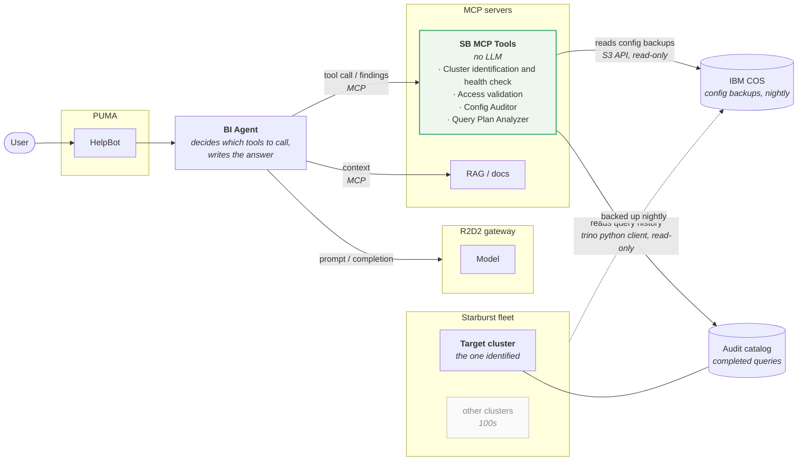
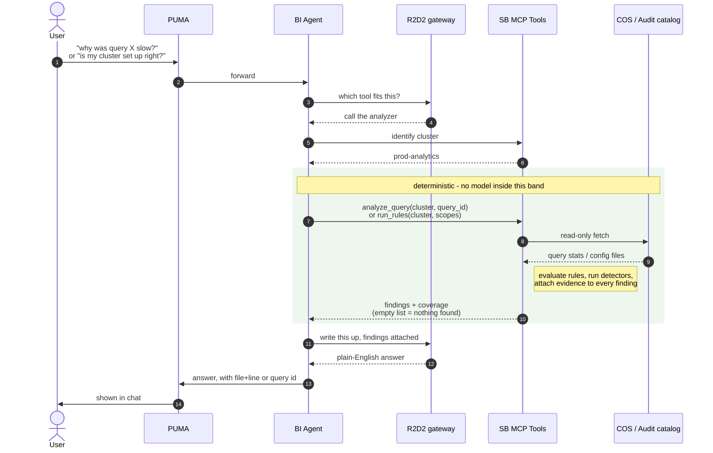
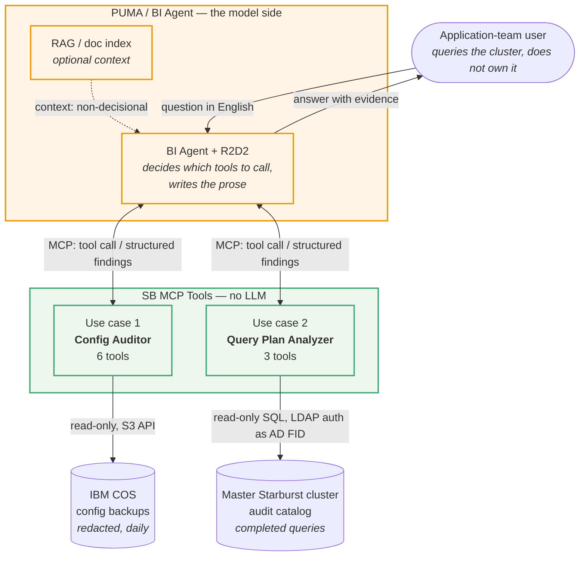
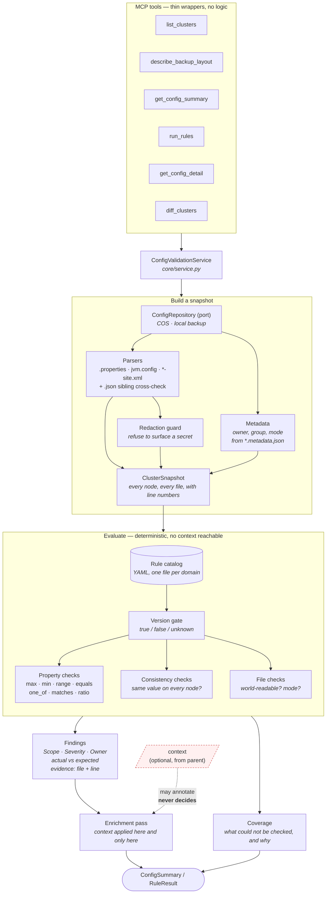
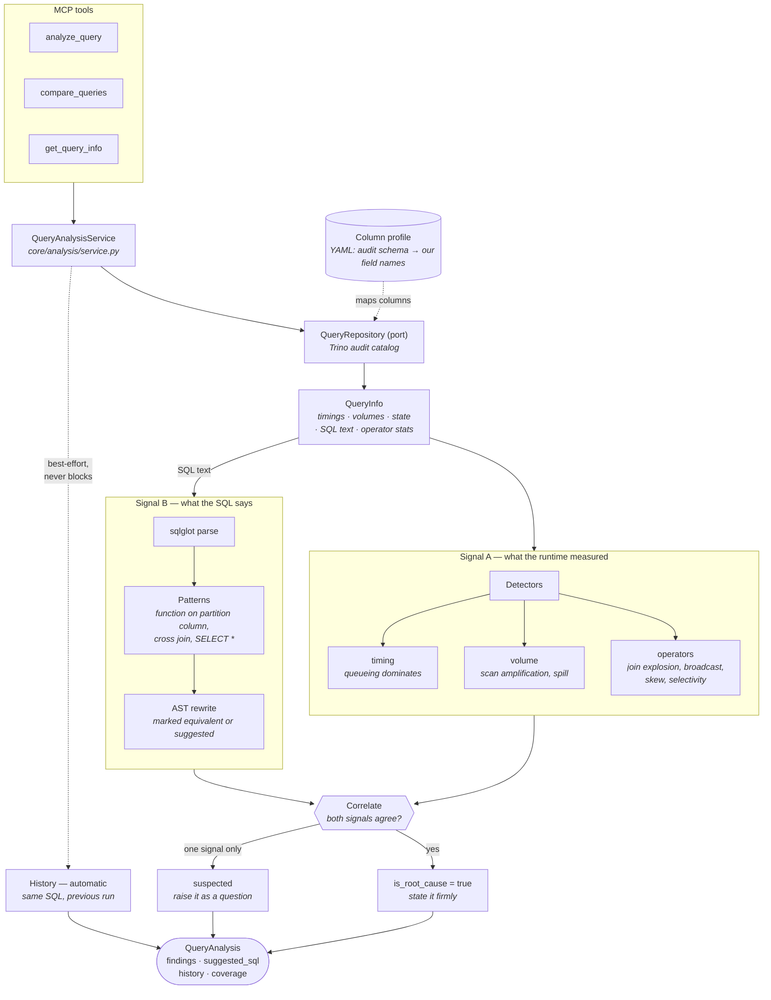
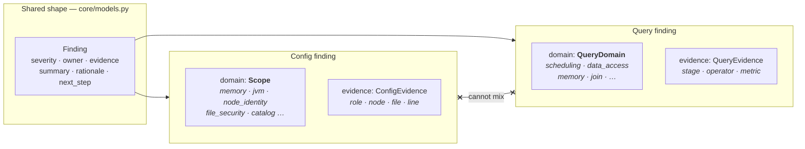
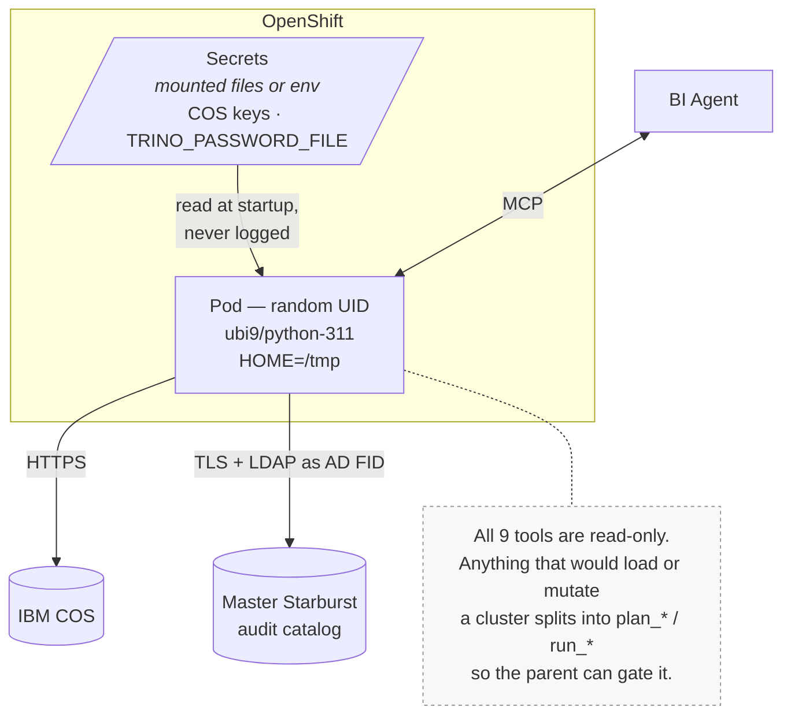
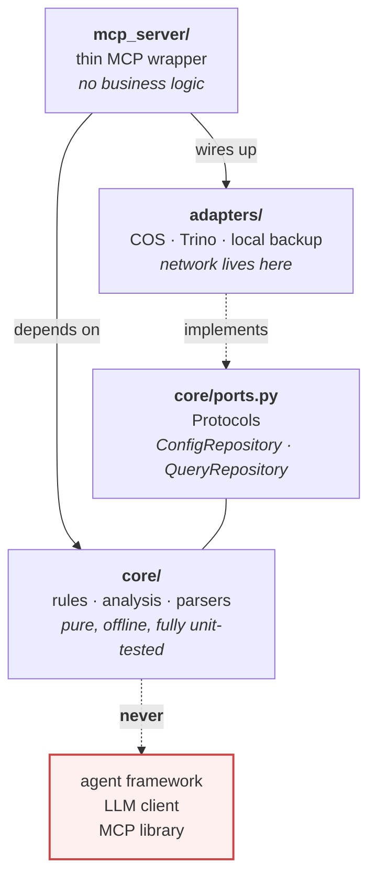

# Architecture

`SPEC.md` is the design document; this file is the picture of it.

Start with the two diagrams below -- the pieces, and the request flow. The
sections after them are detail, and only worth opening when you need it.

---

## Components

What exists, and what talks to what. (This is a *component diagram* -- C4
calls the same thing a container diagram.)

**How to read it:** PUMA is where the user types. The BI Agent behind it
reaches the model through the R2D2 gateway, and reaches data through MCP
servers — never the other way round. Cluster identification is part of the SB
MCP Tools already, from the earlier use cases, so identifying the cluster and
auditing it are two calls to the same server rather than a hop between two.

Arrow labels say what crosses the line and how, not which feature sits at the
end of it. The feature names are already inside the box; what a reader cannot
otherwise tell is that one connection is object storage and the other is SQL.

The agent identifies the cluster first, then passes that name into every
following call. The tools never pick a cluster themselves — scope is always
an argument, so there is no `validate_everything()`.

From there the two use cases diverge, and they share nothing but the server
they live in. The Config Auditor reads last night's backup from COS. The
Query Plan Analyzer reads the audit catalog.

> Worth confirming: the diagram shows the audit catalog belonging to the
> identified cluster. If one master cluster federates the whole fleet's audit
> catalogs instead, that arrow moves to the master and the cluster name
> becomes a filter rather than a connection target. The adapter currently
> assumes the federated version — one connection, cluster as a `WHERE`
> clause.

---

## Request flow

The same two paths, in order. (This one is a *sequence diagram*.)

The green band is the part that cannot vary: same query id, same findings,
same numbers, every time. The model reads those findings and writes the
sentences -- it is not allowed to add a problem the tools did not return.

---

# Detail

Everything below is the inside of the green band. Skip it unless you need it.

The dependency rule every diagram obeys: **arrows point inward.** `mcp_server`
knows about `core`; `core` knows about nothing above it. That is what makes
the eventual LangGraph-to-ADK migration a copy of `core/` plus a new wrapper.

---

## 1. System context

Where the boundaries are, and which side owns the model.

The green boundary contains no model. Same inputs, same outputs, every time.
Everything that requires judgement — which tool, what to say — is on the
orange side. That split is the whole design: the BI Agent can be replaced
without touching a rule.

---

## 2. Use case 1 — Config auditor

**Question:** *is this cluster configured correctly?*
**Reads:** config backups. **Knows nothing about** any individual query.

Two things the diagram is making a point of:

- **Context enters after the findings exist.** It is not an input to
  evaluation — it cannot be reached from there. That is structural, not a
  convention, which is why a rule cannot be suppressed by a document.
- **Coverage leaves by its own arrow.** An empty findings list means
  "healthy" only when `coverage.complete` is true. Silence because nothing is
  wrong and silence because little was examined look identical otherwise.

---

## 3. Use case 2 — Query analyzer

**Question:** *why was this query slow?*
**Reads:** completed-query history. **Knows nothing about** whether the
cluster is correctly configured.

The correlation node is the interesting part. A huge scan on its own is a
symptom; `year(order_date)` in a WHERE clause on its own is a suspicion.
The two together are a root cause, and only then does the answer stop
hedging.

`history` hangs off the side deliberately: a query with no earlier run is
normal, and a failed lookup costs the context, never the findings.

---

## 4. Why the two stay separate

They share the *shape* of a finding and nothing else. mypy proves the
taxonomies cannot overlap, and a test asserts it.

Tagging a slow query with a config `Scope` would claim the slowness is a fact
about `catalog/*.properties`. It is not, and a user who acts on that claim
goes looking in the wrong file.

---

## 5. Deployment

---

## 6. What the layers may import

The rule that survives every migration.

`core/` importing an agent framework is the one thing that would make the
migration a rewrite instead of a copy. Nothing there imports over the
network at module load either, which is why the whole suite runs offline in
about two seconds.
